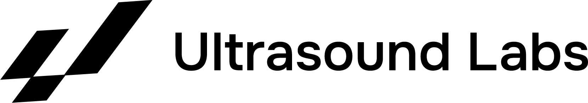

# Ultasound Labs brand-kit

This is our brand kit, containing details on how we use our brand assets.

## Logos
| Symbol | Wordmark |
|:----:|:--------:|
|   | |
[svg](logo/symbol/ultrasoundlabs_symbol_white.svg), [png](logo/symbol/ultrasoundlabs_symbol_white.png) | [svg](logo/wordmark/ultrasoundlabs_wordmark_white.svg), [png](logo/wordmark/ultrasoundlabs_wordmark_white.png)
|  |   | 
[svg](logo/symbol/ultrasoundlabs_symbol_black.svg), [png](logo/symbol/ultrasoundlabs_symbol_black.png)  | [svg](logo/wordmark/ultrasoundlabs_wordmark_black.svg), [png](logo/wordmark/ultrasoundlabs_wordmark_black.png)

## Fonts

Located in [/fonts](https://github.com/ultrasoundlabs/brandkit/tree/main/font).

##  Colors

-   **White:**  `#FFFFFF`
-   **Black:**  `#000000`

